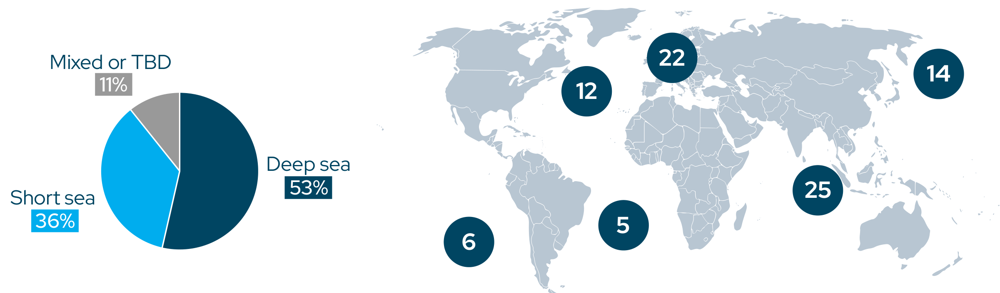
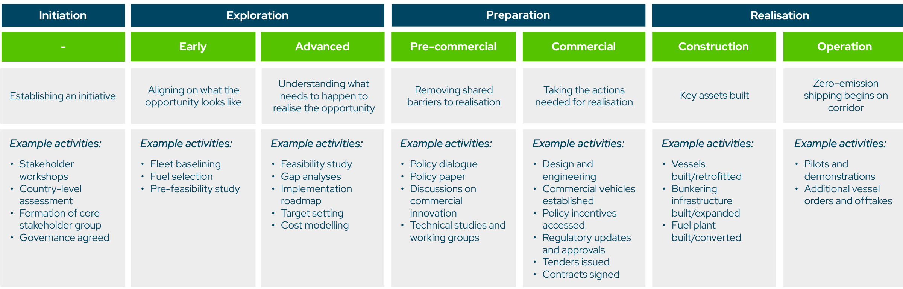
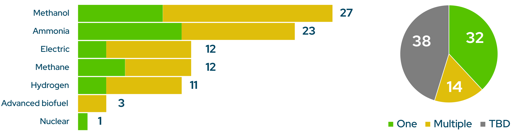
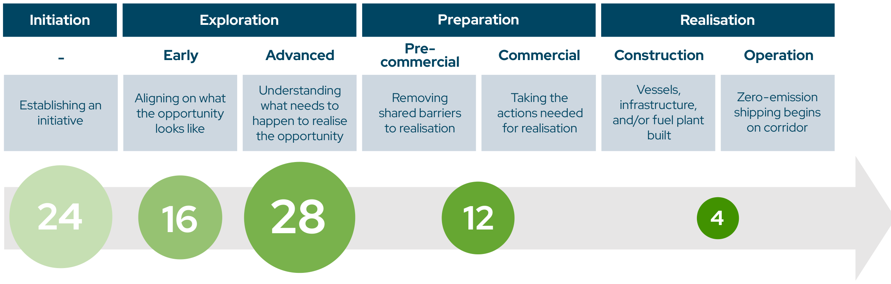

# 绿色航运走廊增至 84 条，但商业闭环仍未形成 | *Annual Progress Report 2025*

<a href="#industry-signal">#IndustrySignals</a><a href="#shipping">#Shipping</a><a href="#policy">#Policy</a><a href="#green-corridors">#GreenCorridors</a>

> Chan, I. (2025). *At a Crossroads: Annual Progress Report on Green Shipping Corridors 2025*. Global Maritime Forum, on behalf of the Getting to Zero Coalition. https://globalmaritimeforum.org/report/annual-progress-report-on-green-shipping-corridors-2025/

这份年度报告由 Global Maritime Forum 代表 Getting to Zero Coalition 编制，Isabelle Chan 为主笔。它盘点的是各方宣布的绿色航运走廊倡议，而非已经全面以零排放燃料运营的航线。截至 2025 年 10 月 1 日，报告收录 84 个倡议，比上一版多 25 个。中国、印度、巴西、智利、加纳和肯尼亚都有新增项目。

数字上看，绿色走廊仍在扩张；真正卡住项目的，是把燃料、船舶、港口和货主的承诺接成一笔能落地的交易。报告把这种障碍称为“可行性墙”：零排放燃料与常规燃料之间的成本差，以及货主为低碳运输支付溢价的意愿不足。

**图 2｜组合已经跨越多个区域，但以远洋航线为主。** 报告将 53% 的倡议归为远洋航运、36% 归为短海航运，另有 11% 属于混合或尚未明确类型；右图按报告口径给出各区域所涉倡议数量。这张图说明绿色走廊并非只在少数传统航运中心扩张，但它不代表各区域实际投入的燃料、船舶或基础设施规模。图源：Chan, I. (2025). *At a Crossroads: Annual Progress Report on Green Shipping Corridors 2025*. Global Maritime Forum, on behalf of the Getting to Zero Coalition, p. 8。

## 信号先行

- 84 个倡议中，24 个还在 Initiation，44 个处于 Exploration，12 个进入 Preparation，4 个进入 Realisation。后两级意味着项目开始清除共同障碍，或已建设、运营船舶、基础设施或燃料设施；不能把 84 个倡议都当作已部署项目。
- 甲醇和氨是被提及最多的燃料路径，分别出现在 27 和 23 个倡议中。这个统计反映的是项目方的路径选择或兴趣，不是已签署的燃料采购量。
- 走廊的直接投资影响仍然有限。报告访谈显示，连接、知识和行业认知的影响较明显，投资影响则较低；许多商业准备工作在走廊联盟之外完成。
- 四个进入 Realisation 的案例没有共同的万能商业模式：有的依靠欧盟监管下的燃料池机制，有的由大货主的减排目标推动，也有公共支持参与分担成本。

## 这组数字说明什么？

| 截至 2025 年 10 月 1 日的报告口径 | 数量 | 应如何解读 |
|---|---:|---|
| 绿色走廊倡议 | 84 | 已宣布、且符合报告定义的倡议数，不等于运营中的零排放航线。 |
| 较上一版新增 | 25 | 说明参与地域和项目数量继续扩大。 |
| 进入 Preparation | 12 | 项目在开展政策协调、技术研究、商业载体、招标、合同或工程设计等工作。 |
| 进入 Realisation | 4 | 船舶、加注基础设施或燃料设施已开始建设或运营。 |
| 纳入的利益相关方 | 305 | 参与主体数量，不等于每一方都承担采购或投资义务。 |

**图 1｜“有倡议”与“已部署”之间隔着多个工作阶段。** 图中将走廊推进划分为 Initiation、Exploration、Preparation 和 Realisation，并细分为七个状态。Preparation 包括政策协调、技术研究、商业载体、招标与合同等工作；Realisation 才涉及船舶、加注设施或燃料工厂的建设与运营。它是报告用来描述项目进展的框架，不是对单个项目进行财务或技术审计。图源：Chan, I. (2025). *At a Crossroads: Annual Progress Report on Green Shipping Corridors 2025*. Global Maritime Forum, on behalf of the Getting to Zero Coalition, p. 7。

报告的四阶段框架有助于区分“成立一个走廊”与“让走廊跑起来”。Initiation 主要形成合作关系和治理；Exploration 做基线、可行性与燃料选择；Preparation 开始处理许可、技术、合同和融资等共同障碍；Realisation 才进入船舶、基础设施或燃料设施建设与运营。报告同时提醒，现实中的活动可能交叠，部分项目也会跳过框架中的步骤，因此阶段不应被当作精确的项目审计评级。

## 燃料选择仍在等待商业确定性

甲醇和氨在组合中领先，电动、甲烷和氢也被多个项目列为方向。报告的解释很克制：许多倡议还处在早期，尚未能确定燃料；另一些则在等待市场和国际规则提供更清晰的价格与合规信号。对港口和燃料供应商而言，这意味着“被列入走廊”不等于可以据此建设某一种燃料的全部产能。

**图 4｜燃料偏好正在集中，但不少项目仍未作出单一路径选择。** 甲醇和氨分别被 27 和 23 个倡议提及；图右还显示，38 个倡议的燃料路径尚待确定，14 个考虑多种路径，32 个选择一种路径。它支持的是“技术路线尚未完全收敛”的判断，而不能据此推断这些燃料已经获得相同规模的供应合同或港口加注能力。图源：Chan, I. (2025). *At a Crossroads: Annual Progress Report on Green Shipping Corridors 2025*. Global Maritime Forum, on behalf of the Getting to Zero Coalition, p. 9。

在更成熟的项目中，工作重点已经从早期的燃料试点和安全程序，转向供应链、可持续性认证、成本估算、工程设计和商业安排。这个变化比燃料名称更值得追踪。没有长期供给、认证与风险分担，燃料偏好不会自然变成加注需求。

## 最大缺口不在倡议名单里

报告发现，项目从 Preparation 走到 Realisation 时，最大的障碍仍是电制燃料的成本差和货主溢价支付意愿。四个已经进入 Realisation 的案例采用了不同方式：欧洲短海航线利用 FuelEU Maritime 和 EU ETS 下的合规池化安排；澳大利亚至中国铁矿石航线更多依赖大型货主的 2030 减排承诺；另有项目获得公共支持。它们说明商业闭环需要贴合航线、货物和政策环境，而不是复制单一模板。

**图 7｜项目数量在前两阶段聚集，进入部署前后的项目仍少。** 报告将 24 个倡议列为 Initiation，16 个为早期 Exploration，28 个为高级 Exploration，12 个为 Preparation，4 个为 Realisation。图中的圆形大小按数量变化；它直观说明“从研究与协调走向建设和运营”仍是组合中的窄口。阶段之间可能重叠或被跳过，因此这幅图不能用于计算项目的平均推进速度。图源：Chan, I. (2025). *At a Crossroads: Annual Progress Report on Green Shipping Corridors 2025*. Global Maritime Forum, on behalf of the Getting to Zero Coalition, p. 11。

报告还给出一个需要谨慎对待的投资信号：在其掌握的信息中，约 120 家公司已投资或租用甲醇、氨燃料船舶，其中约 15 家参与绿色走廊；只有 5 家宣布将在其参与的走廊上部署相关船舶。公开部署信息并不完整，报告也没有据此断言因果关系。但这个差距足以说明，项目联盟、船舶订单和实际航线部署仍是三件不同的事。

## 对行业的含义

对船东和货主，下一步不是再给一条走廊贴上“绿色”标签，而是明确谁购买燃料属性、谁承受价格波动、谁承担首批船舶和加注设施的利用率风险。报告建议把具有减排目标的货主更早纳入机制设计，现有的 ZEMBA 等需求聚合平台是其中一个接口。

对港口和燃料供应商，走廊倡议可用于协调认证、许可、安全与加注安排，但投资决策仍要回到可验证的长期需求和上游能源条件。报告中的燃料类别不能代替具体的供给合同或基础设施利用率测算。

对政策制定者，报告指向的并非单一补贴，而是一组能缩小成本缺口、减少早期项目风险的工具。其访谈和案例也提示，政策窗口与项目时间表必须相互匹配；否则，走廊可能停留在研究、对话和知识共享阶段。

## 证据边界

报告通过案头研究、对项目牵头方或主要联系人的问卷及半结构化访谈收集信息；访谈和问卷在 2025 年 8—9 月进行，接近 70% 的走廊信息由倡议代表核验。其余信息主要来自案头研究。这使报告适合观察全球组合的进展与共同障碍，但不适合替代某一航线的燃料价格、船舶改造成本或投资回报测算。

报告的影响评估也以选定企业和组织的访谈为基础。它能显示参与者如何评价走廊带来的连接、知识和投资变化，却不能独立证明走廊本身造成了某一笔投资或某一项减排。读者在引用“84 个倡议”时，仍应同时保留这一层差别：倡议在增加，零排放资产的商业部署还在起步。

## 原报告

Chan, I. (2025). *At a Crossroads: Annual Progress Report on Green Shipping Corridors 2025*. Global Maritime Forum, on behalf of the Getting to Zero Coalition. [报告页面与下载](https://globalmaritimeforum.org/report/annual-progress-report-on-green-shipping-corridors-2025/)。
