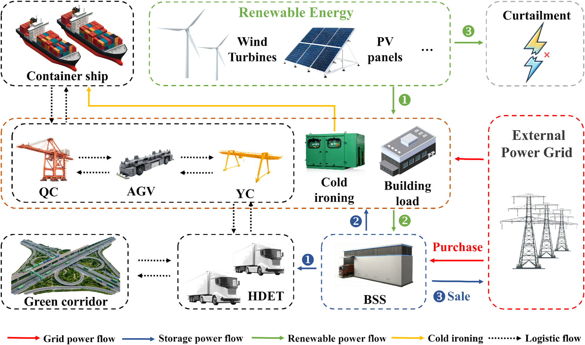
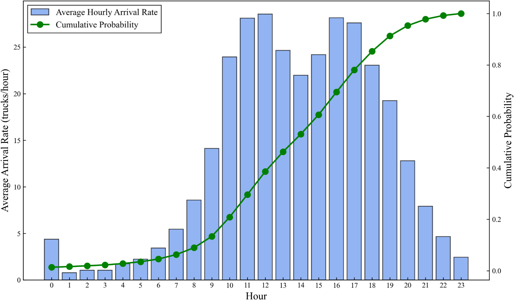
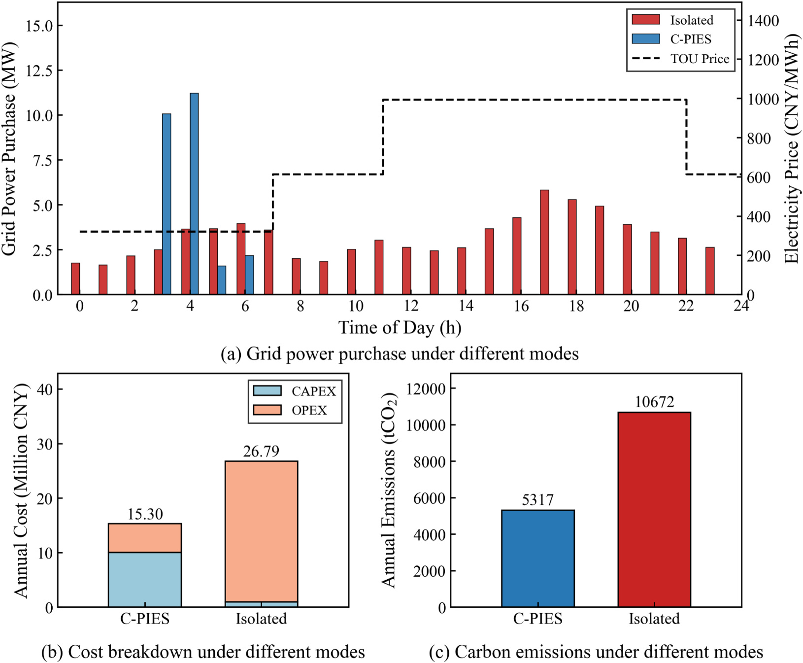
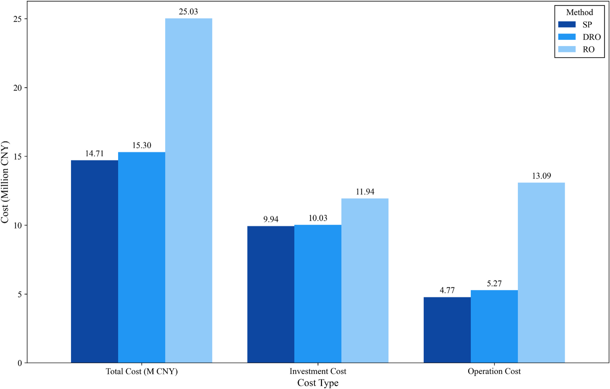

# 港口不只是终点：重卡电动化如何与走廊能源系统协同规划

<a href="#research-brief">#ResearchBrief</a><a href="#freight-corridor">#FreightCorridor</a><a href="#truck-electrification">#TruckElectrification</a><a href="#port-energy">#PortEnergy</a><a href="#optimisation">#Optimisation</a>

> Wang, R., Feng, X., Wang, S., Tao, K., Zhang, Y., Yuen, K. F., & Wu, M. (2026). *Collaborative planning framework for heavy-duty truck electrification: Corridor-port integrated energy systems*. *Transportation Research Part D: Transport and Environment, 159*, 105537. https://doi.org/10.1016/j.trd.2026.105537

作者团队包括河海大学海运物流与绿色发展研究所的 Ruihua Wang、Xuejun Feng、Suyang Wang、Kaixuan Tao、Yan Zhang，以及新加坡南洋理工大学土木与环境工程学院的 Kum Fai Yuen、Min Wu。Ruihua Wang 为第一作者；Xuejun Feng、Yan Zhang、Kum Fai Yuen 和 Min Wu 为通讯作者。研究获国家重点研发计划（2021YFB2600203）资助。

作者提出“走廊—港口综合能源系统”（Corridor-Port Integrated Energy System, C-PIES），把港口风电与光伏、港内设备和船舶岸电负荷、腹地电动重卡到港换电需求以及外部电网纳入同一个规划边界。

泉州港案例显示，与港口和走廊各自独立运行的基准模式相比，C-PIES 模型中的年化总成本从 2679 万元降至 1530 万元，降幅为 42.89%；年碳排放从 10,672 tCO₂ 降至 5,317 tCO₂，降幅为 50.2%。这些数字是特定设备成本、电价、可再生能源资源、用地和交通样本下的优化结果，不是所有港口都能直接复制的固定收益率。

## 结论先行

- **港口能源规划需要越过港区边界。** 电动重卡的补能需求来自腹地走廊，但它与港口可再生能源的出力和消纳发生在同一个时间系统中。
- **换电站既是交通设施，也是固定储能。** 备用电池可以在低价或可再生能源充裕时充电，在负荷高峰时放电，从而把随机到港需求转化为可调度资源。
- **协同模式的收益来自成本结构重组。** 案例中的投资成本由 101 万元增至 1003 万元，但运营成本由 2578 万元降至 527 万元，最终降低年化总成本。
- **不确定性处理存在明确代价。** 分布鲁棒优化的总成本比随机规划高 3.7%，但避免完全依赖预设概率分布；传统鲁棒优化则因过度保守，将总成本推高到 2503 万元。
- **电动化比例不能脱离能源扩建讨论。** 泉州港基准情景在约 80% 电动化率附近出现碳强度局部下降，但该拐点会随光伏用地和风电投资条件改变，不能视为通用阈值。

## 研究回答了什么？

现有港口综合能源研究往往把港内岸桥、场桥、自动导引车、冷藏箱和船舶岸电视为主要负荷，港外重卡则属于另一套交通规划。论文关注的问题是：当重卡电动化沿港口—腹地货运走廊推进时，能否把交通到达规律与港口能源基础设施一起规划，使港口从用能节点转变为区域能源枢纽？

作者建立两阶段分布鲁棒优化模型。第一阶段决定风机、光伏和换电站的建设容量；第二阶段在风光出力与重卡到达数量不确定的情况下安排购售电、弃电、储能充放电和换电服务。模型使用 Wasserstein 距离构造概率分布模糊集，不要求未来数据严格服从某个预设分布，同时避免传统鲁棒优化对极端组合一律配置冗余设施。

重卡需求不是用均匀流量代替。研究使用泉州—厦门货运走廊的高频 GPS 轨迹识别车辆到港节奏，再用非齐次泊松过程描述每小时到达率。这个处理把交通活动与能源负荷连接起来，但仍是规划模型而非实地示范项目：结果表示在给定数据和假设下的最优配置，不代表相关设备已经建设或完成商业验证。

## 走廊与港口为何需要同一套能源边界？

**图 1｜港口可再生能源、港内负荷和走廊换电需求被放入同一能量流。** 绿色箭头表示可再生电力优先满足港内负荷，再为换电站充电；蓝色箭头表示储能放电；红色箭头表示与外部电网的购售电。换电站通过备用电池把重卡运输与电池充电在时间上解耦。图源：Wang et al. (2026), *Transportation Research Part D*, Fig. 1, PDF p. 5；由 Zotero PDF 提取，未修改。

在传统的独立模式中，港口只为自己的设备和岸电配置能源，走廊上的电动重卡单独从电网补能。这样容易出现两种错配：港口风光富余时找不到足够负荷，而大量重卡集中到港时又在高电价、高碳强度时段形成刚性需求。

C-PIES 的调度顺序是：港口风光先供应岸桥、场桥、建筑和船舶岸电等港内负荷，剩余电量为换电站备用电池充电；重卡到港后优先使用已充电电池；当风光不足时，换电站释放储能，仍有缺口才从外部电网购电。换电站因此不只是缩短车辆补能时间，也成为连接“源—荷—储”的缓冲层。

## GPS 到港节奏如何变成能源需求？

**图 5｜换电负荷有明显的日内峰谷，而不是恒定需求。** 样本中重卡到达主要集中在白天，约 11—12 时和 16—17 时形成较高到达率。柱形表示每小时平均到达率，折线为累计概率。图源：Wang et al. (2026), *Transportation Research Part D*, Fig. 5, PDF p. 15；由 Zotero PDF 提取，未修改。

作者从车辆 GPS 轨迹中识别泉州港到港车辆，构造时变到达强度，并用 Monte Carlo 方法生成不确定场景。走廊侧的交通随机性由此进入能源规划：到港高峰决定换电负荷何时出现，港口的风光出力、电价和其他负荷则决定电池何时充电更经济。

这种连接比按日均车流配置充电功率更有信息量。日均值可能同时掩盖交通峰值和光伏峰值，导致设施规模正确、运行时序错误。不过，论文所用数据来自特定走廊和时段，车辆组织、港口班次和道路拥堵变化都可能改变到达分布；在其他港口应用时，需要重新估计而不是直接搬用泉州参数。

## 42.89% 成本下降是怎样形成的？

**图 10｜协同模式增加前期投资，但显著压低运营成本和碳排放。** C-PIES 年化总成本为 1530 万元，独立模式为 2679 万元；对应碳排放分别为 5,317 和 10,672 tCO₂。上图还显示协同模式把部分购电移动到低价时段，并在高价时段依靠本地可再生能源和储能。图源：Wang et al. (2026), *Transportation Research Part D*, Fig. 10, PDF p. 19；由 Zotero PDF 提取，未修改。

论文给出的第一阶段配置包括 6.00 MW 风电、5.32 MW 光伏和 64.86 MWh 换电站储能容量。协同模式的年化投资成本为 1003 万元，明显高于独立模式的 101 万元；但运营成本由 2578 万元降到 527 万元，使总成本下降 42.89%。这意味着优势并非来自“少建设”，而是用更高的固定资产投入替代长期高峰购电和分散补能成本。

在日内调度中，97.72% 的储能充电发生在谷价期，累计充电 16.41 MWh；高峰期释放 5.86 MWh，替代该时段 43.77% 的负荷。论文把这种策略概括为低价储能、高价放电，同时利用港口风光减少电网购电。无储能情景下的每日购电成本为 36,846.27 元，采用该策略后为 9,570.90 元。

这些结果依赖峰谷电价差、设备成本、储能寿命和本地风光资源。如果电价结构更平、储能退化成本更高或港口缺乏可再生能源建设空间，成本优势可能缩小。文中比较的是模型情景，不包含多主体融资、土地审批、换电标准兼容和车队采用速度等实施摩擦。

## 鲁棒性需要付出多少成本？

**图 15｜分布鲁棒优化位于低成本与保守冗余之间。** 随机规划（SP）、分布鲁棒优化（DRO）和鲁棒优化（RO）的年化总成本分别为 1471、1530 和 2503 万元。DRO 比 SP 高 3.7%，但不像 SP 那样要求预设分布准确；RO 则需要覆盖不确定区间中的极端组合，投资和运营成本都更高。图源：Wang et al. (2026), *Transportation Research Part D*, Fig. 15, PDF p. 22；由 Zotero PDF 提取，未修改。

随机规划给出最低成本，但它假设选定的概率分布能够代表未来的风光和车流。传统鲁棒优化不依赖精确概率，却可能同时防御“可再生能源接近零、负荷恰在峰值”等低概率极端组合，因而配置过多冗余。DRO 用历史样本周围的一组可能分布进行最坏情形优化，在本案例中用约 3.7% 的成本溢价换取对分布偏差的保护。

这项比较说明模型选择也是规划偏好的表达：追求期望成本最低、追求极端安全，或接受有限成本溢价提高分布稳健性，会导向不同的基础设施规模。论文没有通过多年样本外运行检验直接证明 DRO 在真实运营中一定优于其他方法，因此“更稳健”主要来自模型结构与案例内比较。

## 电动化比例不是孤立目标

随着重卡电动化率从 0 提高到 100%，柴油车直接排放持续下降，电网购电的间接排放增加，但案例中的系统总排放仍持续低于未电动化基准。约 80% 电动化率时，模型新增一台风机，使碳强度出现局部下降；到 90% 以后，港区光伏用地达到 5.32 MW 容量上限，进一步减排需要更昂贵的风电和储能配置，边际收益减弱。

作者的敏感性分析表明，增加光伏用地会移动碳强度最低点，扩大风电投资也会降低高电动化率下的碳强度。因此，80% 不是建议所有港口采用的目标值。更可靠的决策方式是将车队电动化目标与风光扩建、储能容量、电网交互和土地条件共同优化。

## 对港口与绿色货运走廊的启示

对港口管理者，规划边界需要从港区围栏扩展到腹地交通。重卡补能需求虽然发生在道路运输系统，却可能决定港口风光和储能的经济规模。将港内能源部门与走廊交通管理分开采购、分开预测，容易错过负荷互补。

对车队和换电运营商，换电站的价值不能只用服务车辆数量衡量。备用电池同时提供时移、削峰和可再生能源消纳，其收益需要在换电服务、电力市场和港口微电网之间分配。这也带来新的治理问题：谁投资电池、谁获得峰谷套利收益、谁承担退化和应急容量成本，论文尚未建立多主体合同机制。

对政策制定者，电动化补贴和可再生能源扩建政策需要协同。只提高电动重卡渗透率而不扩展低碳电源、储能和配电能力，可能把柴油排放转移为电网间接排放；只建设港口风光而没有可调负荷，也可能造成弃电。走廊政策应把车队采用、补能标准、港区土地、电网接入和数据共享放在同一实施路线图中。

## 局限性

- 研究是泉州港单案例的规划优化，42.89% 和 50.2% 均依赖本地电价、资源、设备成本、用地与交通参数，不能直接外推到其他港口。
- 模型聚焦电力一种能源载体，对氢、甲醇、氨等多能源路径没有联合规划。
- 港内柔性负荷和船舶岸电连接过程经过简化，现实中的泊位计划、设备作业约束和电网接入限制可能改变调度空间。
- GPS 样本支持到港规律估计，但未来车流可能受车队扩张、道路拥堵、季节和政策影响；论文没有报告跨年度样本外运行验证。
- 模型以统一系统成本为目标，尚未处理港口、车队、换电运营商、电网和能源投资者之间的成本收益分配与投资协调。

## 原文

Wang, R., Feng, X., Wang, S., Tao, K., Zhang, Y., Yuen, K. F., & Wu, M. (2026). *Collaborative planning framework for heavy-duty truck electrification: Corridor-port integrated energy systems*. *Transportation Research Part D: Transport and Environment, 159*, 105537. [https://doi.org/10.1016/j.trd.2026.105537](https://doi.org/10.1016/j.trd.2026.105537)
