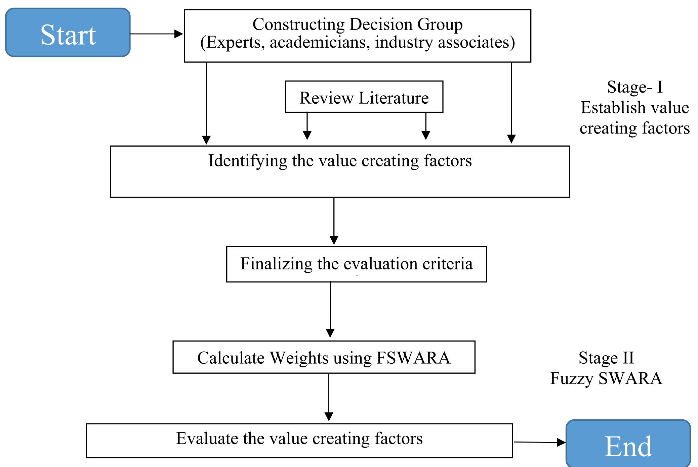
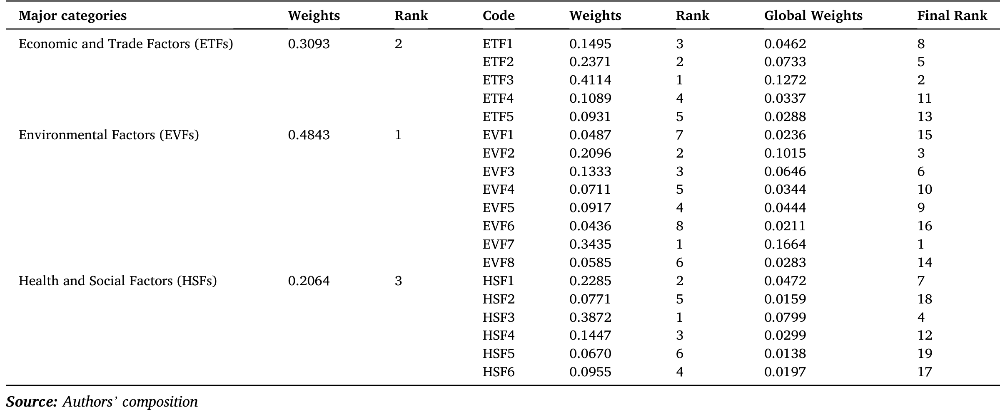
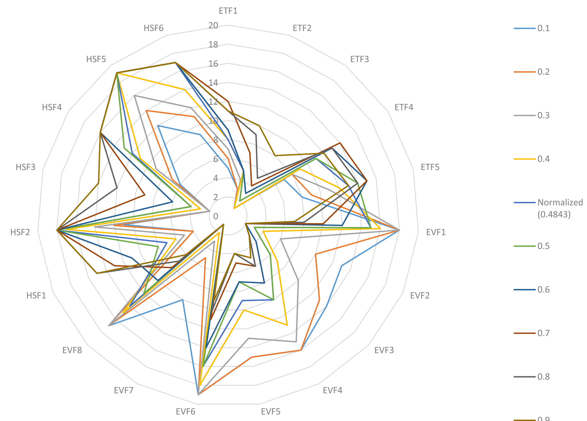

# 绿色航运走廊如何创造价值 | *Transportation Research Part D*

<a href="#">#ResearchBrief</a><a href="#">#Shipping</a><a href="#">#Policy</a><a href="#">#Economy</a>

> Garg, C. P., Kashav, V., & Lam, J. S. L. (2025). *Evaluation of value creating factors in green shipping corridors*. *Transportation Research Part D: Transport and Environment, 145*, 104790. https://doi.org/10.1016/j.trd.2025.104790

这项研究由印度管理学院罗塔克分校、UPES 德拉敦分校商学院和丹麦技术大学共同完成。三位作者按字母排序并声明贡献相等；Jasmine Siu Lee Lam（丹麦技术大学技术、管理与经济学系）是通讯作者。研究邀请 30 位国际专家，对绿色航运走廊的价值创造因素进行评估。

绿色航运走廊若只以替代燃料吨数或减排量来衡量，往往会漏掉项目为何能持续运作。论文把价值分为环境、经济贸易、健康与社会三类因素，并细化为 19 项子因素。它提供的是相对优先级框架，而不是某条航线的成本预测或建设清单。

## 结论先行

环境因素的归一化权重为 0.4843，经济贸易因素为 0.3093，健康与社会因素为 0.2064。全部 19 项子因素中，能源效率、能量回收与节约居首（0.1664），其后为吸引绿色投资（0.1272）、空气质量改善（0.1015）和周边社区福祉（0.0799）。低碳走廊的价值来自能耗、资本与港口周边影响能否被放在同一张账上处理。

## 图 1｜从因素清单到权重

图 1显示研究先通过文献与专家意见确定三类因素和 19 个子因素，再用模糊 SWARA 将专家语言判断转换为权重，最后回访专家确认排序。它是一项结构化的主观判断聚合，不是对真实项目绩效的因果估计。结果可以指引讨论的优先级，却不能证明绿色投资会自动流入，或某项能效提升必然改善社区福祉。

## 表 8｜优先级把能源、资本与社区放在同一张账上

表 8将类别权重与子因素权重相乘得到全局权重。环境因素排第一并不意味着经济或社会因素可以被忽略：绿色投资位列第二，表明资本进入是走廊由试点走向持续运营的前提；社区福祉位列第四，意味着空气、噪声、土地和就业影响已进入专家对“价值”的定义。能源效率覆盖船舶设计、航速、靠港与装卸衔接，因而不能被理解为单纯的船上节油。

## 图 2｜排序会变

作者把环境因素权重由 0.1 调整到 0.9。环境权重较低时，吸引绿色投资排第一；达到基准权重 0.4843 后，能源效率、能量回收与节约保持第一。这个结果说明优先序有条件性：项目仍在寻找资本和货主承诺时，融资吸引力可能压过技术效率；环境约束更强时，能效会成为直接的价值驱动。敏感性分析只测试一个类别权重变化，不能衡量透明报告、认证或公众沟通对融资和许可的实际作用。

## 启示

对走廊发起方，能源效率应当成为项目的起点。船东、港口和货主可围绕航速、靠港等待、岸电、装卸节奏、燃料损耗与装载率建立共同基线；这既能在替代燃料大规模供应之前降低能耗和成本，也为后续生命周期核算留下可比较的数据。绿色投资排在第二位，说明资金安排不能只覆盖码头设备或一批新船，而要把燃料需求、环境属性、货主承诺和跨港服务连续性放入同一套商业安排。港口单独建设设施而没有长期需求，或货主只提出减排目标而不承担相应运价，都会让项目缺少现金流。

社区福祉位列第四，也要求项目方把周边影响做成可交付成果。空气质量、噪声、就业、土地占用和交通组织会影响新燃料储运、岸电扩容和码头改造的接受程度。项目可以提前发布可核验的基线与年度结果，将污染物、就业培训、投诉处理、公众沟通和收益分配写入指标。它不会保证项目获批，但能让技术、融资与社会许可在同一时间表内接受检验。

## 局限性

论文基于 30 位国际专家的模糊 SWARA 判断，适合在信息不足、目标难以直接比较的早期阶段建立优先级，但不能替代实测数据或项目财务模型。专家的职业构成、地域经验和对燃料与法规的预期都会影响权重；不同航线面对的货类、船龄、港口腹地、电网碳强度和燃料供给结构不同，排序可能变化。研究没有报告提高一单位能效会减少多少成本或污染物，因此全局权重不能被当作投资回报率或减排弹性。

敏感性分析只改变环境因素的类别权重，没有同时扰动燃料价格、资本成本、法规、需求和基础设施容量。透明报告在图中居后，也不代表它可有可无，因为认证、披露和公众信任可能经由融资、货主选择或许可间接影响项目成败，而这些机制不在模型范围内。实际应用时，应由本地各方重新赋权，并与船舶能耗、靠港记录、燃料合同、配电接入、空气质量和就业数据并列，再用多时点与真实项目结果检验排序是否稳定。
