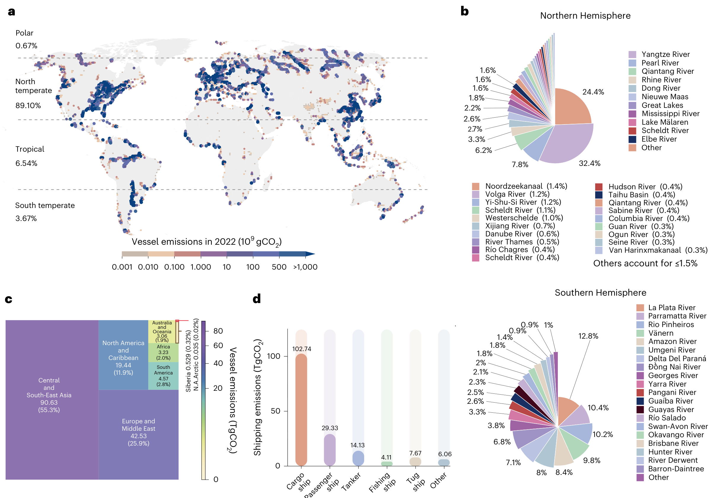
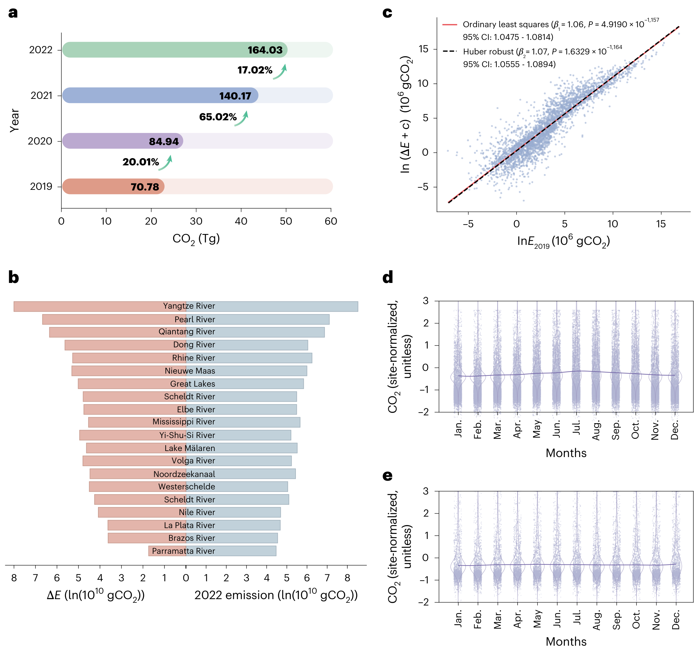
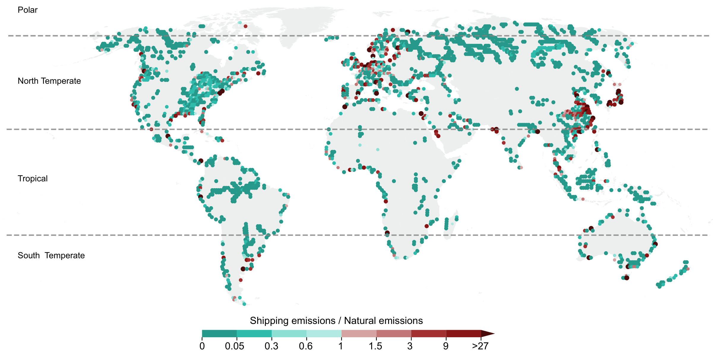

# 河流船舶排放：全球水运碳账本中被低估的一块 | *Nature Climate Change*

<a href="#research-brief">#ResearchBrief</a><a href="#inland-shipping">#InlandShipping</a><a href="#emissions">#Emissions</a><a href="#rivers">#Rivers</a><a href="#climate">#Climate</a>

> Lu, D., Zhang, D., Wang, S., Wang, H., Min, Z., Li, X., Wu, Y., Huang, Y., Wang, T., Liu, S., Xia, X., Yan, X., & Jiang, G. (2026). *Global vessel carbon dioxide emission from navigable rivers*. *Nature Climate Change*. https://doi.org/10.1038/s41558-026-02718-6

这项研究由中国科学院生态环境研究中心、江汉大学、武汉理工大学、集美大学和北京师范大学的团队完成。第一作者 Dawei Lu 隶属中国科学院生态环境研究中心和江汉大学；通讯作者为 Tengfei Wang（武汉理工大学）、Shaoda Liu 和 Xinghui Xia（北京师范大学）。研究使用约 200 亿条自动识别系统（AIS）记录和轨迹补全算法，估算全球可航河流上的船舶二氧化碳排放。

论文给出的 2022 年估计为 164.0 ± 1.58 TgCO₂。这一数值约占全球水运船舶 CO₂ 排放的 24.7%，而相关船舶活动覆盖的海洋与内陆可航水面只有 0.4%。排放集中在少数河流走廊，且 2019—2022 年间大致翻倍。这篇论文的价值，是把内河船舶排放从国家或船型总量进一步定位到具体河流、季节和通航条件。

## 结论先行

- **内河船舶排放并非全球水运排放的边角项。** 2022 年估计值为 164.0 ± 1.58 TgCO₂，约占全球水运船舶排放的四分之一。
- **排放高度集中。** 12,289 条被识别为可航的河流中，排放最高的 20 条贡献了总量的 68.72%；长江、莱茵河、密西西比河和多瑙河是主要热点。
- **增长存在放大效应。** 2019—2022 年全球内河船舶排放约翻倍，基线排放较高的河流往往增长更快。
- **运输需求决定排放集中在哪里，水文条件影响高排放何时出现。** 船舶活动强度和周边 GDP 密度与排放的关联强于径流和温度，但温度、降水和通航条件共同塑造季节变化。
- **河流碳交换需要把船舶排放放进同一空间口径。** 在论文估计的可航河段，船舶排放约为河流—大气 CO₂ 逸散量的 80%；两者属于不同排放过程，不能将这一比例外推为全球河流碳通量。

## 研究回答了什么？

此前全球船舶排放清单主要围绕海洋航线、港口和国家统计口径展开。复杂河网中的船舶轨迹容易受到 AIS 信号断裂、航道弯曲和多分汊的影响。论文要回答的是：全球可航河流上的船舶在哪里、何时排放多少 CO₂？这些排放如何随运输需求和水文条件变化？

作者识别出 12,289 条具有持续 AIS 信号的可航河流，包括部分人工航道。研究将 2019—2022 年约 200 亿条 AIS 记录映射到 0.01° × 0.01° 网格，并用轨迹补全方法重建弯曲和多分汊河段的船舶运动。排放估计结合船舶技术规格和活动轨迹。作者通过 100,000 次 Monte Carlo 模拟评估模型输入与排放计算的不确定性，得到 0.97% 的方法学不确定性。

这个设计支持全球空间比较，但不等于逐船实测烟气排放。AIS 覆盖不足、船舶技术参数误差和轨迹补全都会影响结果；小型渔船的排放尤其可能被低估。

## 排放集中在少数河流走廊

**图 1｜排放热点与船型结构并不均匀。** 原论文图 1a 显示全球可航河网的网格排放分布；图 1b、c 分别给出南北半球主要河流和世界区域的贡献；图 1d 显示货船排放为 102.74 TgCO₂，明显高于客船、油轮、拖船和渔船。中东南亚、欧洲与中东、北美与加勒比海三个区域合计贡献 92.9%。图源：Lu et al. (2026), *Nature Climate Change*, Fig. 1, PDF p. 2；图片由 Zotero PDF Figure 提取，未修改。

排放最高的 20 条河流贡献了 68.72%。长江的估计排放为 50.45 TgCO₂ yr⁻¹，莱茵河为 5.18 TgCO₂ yr⁻¹，密西西比河为 2.87 TgCO₂ yr⁻¹，多瑙河为 0.95 TgCO₂ yr⁻¹。热点并不只由河流长度决定。以长江为例，下游河段长度约占全河的 5.7%，却贡献了该河约 40% 的船舶排放，说明港口、货运需求和通航条件在空间上叠加。

对少数高排放河流优先开展船队更新、燃料替代和岸基补能，可能比按全球平均强度分配资源更快产生减排效果。但热点名单不能直接变成投资清单，具体项目仍需核对船型、航次、停靠节点和地方电力条件。

## 排放在 2019—2022 年翻倍，但不是均匀增长

**图 2｜高基线河流增长更快，北半球排放在夏季达到峰值。** 原论文图 2a 显示全球估计排放从 2019 年的 70.78 Tg 增至 2022 年的 164.03 Tg；图 2b 比较主要河流的 2022 年排放与增长；图 2c 的回归斜率约为 1.06—1.07，表示基线排放更高的河流往往增加得更多；图 2d、e 展示南北半球月度变化。图源：Lu et al. (2026), *Nature Climate Change*, Fig. 2, PDF p. 4；图片由 Zotero PDF Figure 提取，未修改。

增长最快的区域是中东南亚，2019—2022 年增加 56.5 TgCO₂；欧洲与中东增加 21.4 TgCO₂；北美与加勒比海增加 9.71 TgCO₂。全球月度排放通常在 2 月最低，峰谷比为 1.47—2.33；北半球多在 7 月达到高点。论文将这一季节差异解释为运输活动与通航水文条件共同作用的结果。

年度总量和月度峰值对应不同的管理问题。年度增长关系到船队更新和燃料基础设施规模，季节峰值则关系到水位、温度、降水和航道可用性的联动。只按年平均排放安排补能设施，可能低估短期高负荷窗口。

## 运输需求决定空间分布，水文条件调节季节变化

作者用广义加性模型（GAM）估计排放与船舶活动强度、河流周边 50 km 缓冲区的 GDP 密度、径流和温度之间的关系。船舶活动强度与排放的关联最强，周边 GDP 密度次之。径流和温度的关系较弱，且呈非线性。按船型分解后，货船解释的方差份额最高，为 27.6%。

这不表示水文条件无关紧要。研究对象本身已经限定为可航河流，因此样本中的径流范围大多对应能够支持航行的水文条件。水文变量更像通航能力的边界条件，运输需求则决定排放在可航河段中如何聚集。亚马逊等高径流河流也可能因河道不稳定而限制内河航行。

船舶排放清单因此不能只用人口、GDP 或河流长度推估，也不能只按气候区分配排放因子。高频 AIS 活动、船型结构和航道季节性需要进入同一空间分析框架。

## 船舶排放与河流 CO₂ 逸散发生在同一条河上

**扩展数据图 5｜可航河段是两种碳通量叠加的空间。** 作者估计 2022 年同一批可航河流的河流—大气 CO₂ 逸散量为 209.1 ± 5.42 TgCO₂ yr⁻¹，船舶排放为 164.0 ± 1.58 TgCO₂ yr⁻¹，合计为 373.1 ± 9.72 TgCO₂ yr⁻¹。约 21.8% 的河流中，船舶排放超过估计的河流逸散。图源：Lu et al. (2026), *Nature Climate Change*, Extended Data Fig. 5, PDF p. 16；图片由 Zotero PDF Figure 提取，未修改。

这里需要保留一条边界：船舶排放和河流 CO₂ 逸散属于不同过程，前者是运输部门的直接排放，后者是河流碳循环的一部分。论文发现船舶活动与气体传输速度存在正相关，这与船舶波浪和螺旋桨混合可能增强水气交换的解释相容，但研究没有直接验证因果机制。泥沙再悬浮等路径仍需过程实验。

## 对内河航运和减排政策的启示

对船队和货主，减排可以先从高排放河流和货船群着手，而不是把所有内河船舶视作同一类资产。论文估计货船排放为 102.74 TgCO₂，占内河船舶排放的主体；不同河流的船型结构并不相同，动力替代、岸电和电动化方案仍需按航线与船型组合设计。

对港口和地方政府，排放热点图可以帮助安排岸电、充换电、低碳燃料和船队更新的先后顺序。论文的空间分辨率足以定位全球河流走廊，但不足以替代港口级可行性研究；基础设施还要结合靠泊时间、功率需求、电网容量和水位季节变化。

对排放清单和气候研究，内河船舶应与海运、道路和铁路保持可比的时空口径。只把船舶排放分配到国家总量，会掩盖跨境河流和局部河段的治理问题，也会错过交通排放与河流碳交换重叠的区域。

## 局限性

- AIS 对小型渔船和信号不连续河段的覆盖不足，可能使部分船型和区域排放偏低。
- 0.97% 的不确定性只对应作者纳入的模型输入与排放计算误差，并不涵盖所有观测缺失和结构性误差。
- 研究识别的是具有持续 AIS 信号的可航河流，不等于所有存在船舶活动的河道；高纬度和季节性断航区域可能代表不足。
- 船舶活动与河流气体传输速度的关联经过 GAM 和稳健性检验，但船舶扰动增强 CO₂ 交换的机制仍需过程实验和更细尺度观测验证。

## 原文、数据与代码

Lu, D., Zhang, D., Wang, S., Wang, H., Min, Z., Li, X., Wu, Y., Huang, Y., Wang, T., Liu, S., Xia, X., Yan, X., & Jiang, G. (2026). *Global vessel carbon dioxide emission from navigable rivers*. *Nature Climate Change*. [https://doi.org/10.1038/s41558-026-02718-6](https://doi.org/10.1038/s41558-026-02718-6)

论文说明源数据随文提供；所选模型代码发布于 [Zenodo](https://doi.org/10.5281/zenodo.18920064)。
