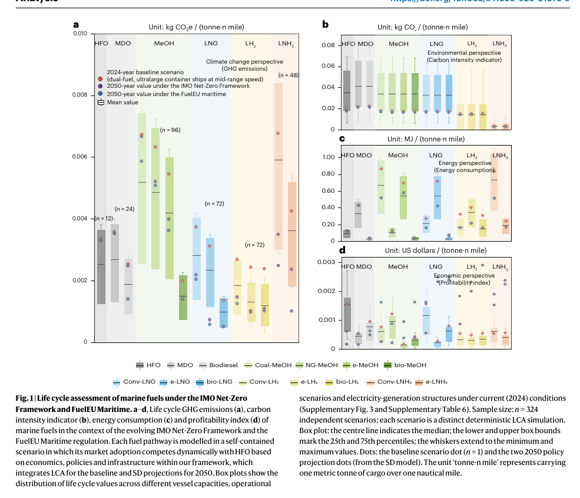
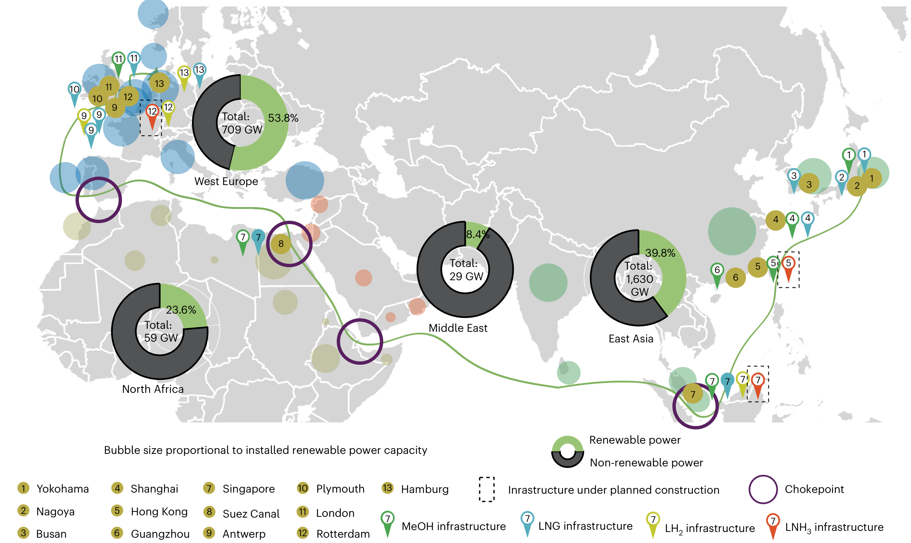
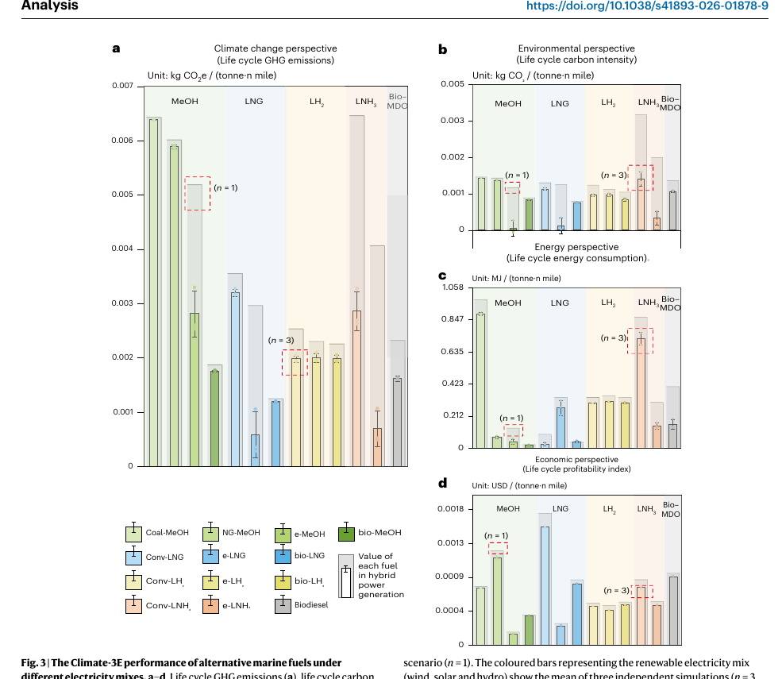
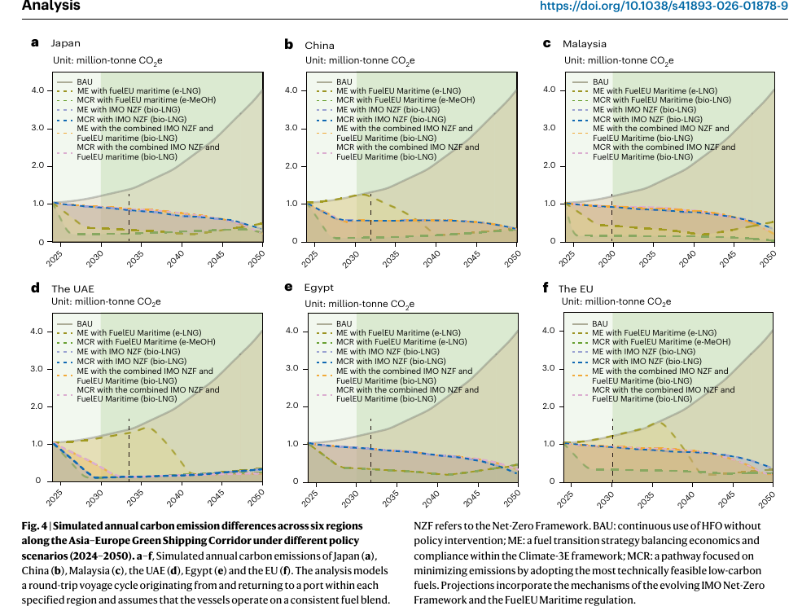
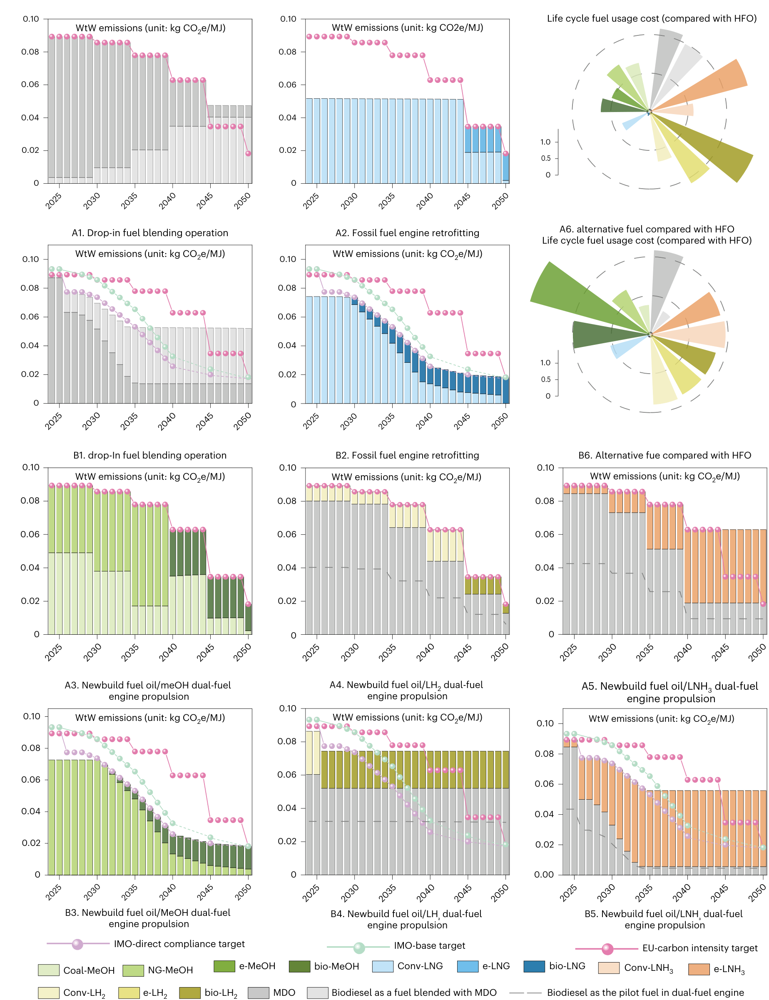

# 亚欧绿色航运走廊的燃料转型：政策、成本与工程约束

<a href="#research-brief">#ResearchBrief</a><a href="#shipping">#Shipping</a><a href="#energy">#Energy</a><a href="#policy">#Policy</a>

> Li, C., Gu, X., Qin, Q., Zhang, W., Xu, G., Yang, J., & Feng, K. (2026). *Phased fuel transitions for decarbonizing the Asia–Europe green shipping corridor*. *Nature Sustainability, 9*, 1256–1265. https://doi.org/10.1038/s41893-026-01878-9

这项研究由来自贵州大学、塔斯马尼亚大学、深圳大学和香港大学的团队完成。共同第一作者为 Chengjiang Li（贵州大学；塔斯马尼亚大学）、Xiu Gu（贵州大学）与 Quande Qin（深圳大学）；通讯作者为 Wei Zhang（贵州大学）和 Kuishuang Feng（香港大学）。论文将生命周期评估与系统动力学模型结合，追踪 13 种船用燃料到 2050 年的排放、能耗和经济性。

亚欧航线的燃料转型并不存在一条“最优燃料”直线。论文给出的核心判断是：近期可以依靠生物燃料降低排放，长期则要转向由低碳电力支撑的电制燃料；但这条路径是否成立，取决于规则何时收紧、电力是否真的低碳，以及船舶和港口能否同步改造。

## 结论先行

- **近期合规与长期净零不是同一件事。** 在作者的情景中，大豆基生物柴油适合近期过渡；2040 年后，电制燃料才成为更主要的减排选项。过渡燃料的价值在于降低眼前风险，并不自动意味着它适合一艘船的整个寿命周期。
- **低碳燃料首先是一项电力工程。** 电制甲醇、e-LNG 和电制氨的生命周期表现，受制于制氢和合成环节所用电力。电网仍以化石能源为主时，燃料在船上“零碳”并不等于全链条低碳。
- **政策会重排成本，而不是替代工程可行性。** FuelEU Maritime 已进入执行期；论文中的 IMO 路径则应理解为一组政策压力测试。政策可以提高高排放燃料的使用成本，却不能解决燃料供应、储罐容积、发动机适配和港口加注等约束。
- **订船和改造要按“转换能力”估值。** 对跨洋船舶而言，最重要的问题不只是 2050 年选哪种燃料，而是 2030—2040 年间能否以可控成本跨过多次规则和燃料供给的切换。

## 这篇研究回答了什么，不能回答什么？

研究以亚欧绿色航运走廊为对象，用 Climate-3E 框架同时评估气候影响、环境表现、生命周期能耗和经济可行性。作者先用生命周期评估（LCA）建立燃料基准，再用系统动力学（SD）模拟 2024—2050 年技术学习、供给、排放与成本的联动。比较对象包括 HFO、MDO、生物柴油，以及甲醇、LNG、液氢和液氨的化石、生物与电制路线。

模型采用每吨货物运输一海里的功能单位，边界从原料获取延伸到船上使用（well-to-wake）。主文报告的总体评估覆盖 1,300 个情景；图 1 所示为其中 324 个独立确定性 LCA 情景。它们是模型情景，不是对 1,300 艘船的观测。

这使论文适合回答“不同燃料路径在给定假设下如何排序”，不适合直接替代项目尽调。它没有为某一艘船、某一合同或某一港口给出可执行报价；将结论用于投资、订造或改造前，仍需将航速、舱容、发动机、加注频率、燃料采购合同和当地电力来源逐项代入。

## 政策：全球规则仍在谈判，欧盟规则已经进入执行期

理解论文中的政策情景，关键是区分已经生效的规则与模型中设定的未来轨迹。

欧盟的 [FuelEU Maritime](https://transport.ec.europa.eu/transport-modes/maritime/decarbonising-maritime-transport/fueleu-maritime_en) 自 2025 年起适用，以 2020 年基准逐步降低船上使用能源的温室气体强度：2025 年为 2%，2030 年为 6%，2035 年为 14.5%，2040 年为 31%，2045 年为 62%，2050 年为 80%。它面向挂靠欧盟港口的大型船舶，以 well-to-wake 的 CO₂、CH₄ 和 N₂O 口径计算。因此，对亚欧航线而言，它已经是采购燃料和配置合规预算时需要面对的现实约束。

论文同时设置了 IMO 净零框架及其与 FuelEU 叠加的路径。应把这一部分理解为前瞻性压力测试，而不是对已生效全球收费机制的描述：IMO 在 2025 年就该框架达成文本层面的推进，但 [正式审议被推迟至 2026 年](https://www.imo.org/en/mediacentre/hottopics/pages/faq-imo-net-zero-framework.aspx)，后续安排仍取决于成员国谈判。这个差别直接影响结果的读法：FuelEU 情景反映已进入执行期的合规经济性；IMO 及叠加情景反映经营者需要为全球规则可能收紧预留的上行风险。

政策的实际作用在于改变过渡期的相对成本。它会让“足够合规”的燃料和“减排最多”的燃料在某些年份靠近，也可能让二者分离。对于船东，合规不是一个静态门槛，而是一串按年份提高的燃料强度约束；对于政策制定者，真正值得检验的是最低成本路径是否会把基础设施和资产锁定在后续难以脱碳的燃料上。

## 经济：成本最低的合规路径，何时偏离长期减排路径？

论文将燃料策略分成 BAU（持续使用 HFO）、ME（兼顾经济性与合规）和 MCR（最大减碳）。图 4 的价值不在于预测某个港口的精确排放量，而在于展示 ME 与 MCR 会在何时分叉：在部分地区的 FuelEU 单独情景下，两条路径一度差距明显；加入论文设定的 IMO 约束后，它们趋于接近。

这揭示了一个容易被忽略的经济问题。短期内，企业追求的往往是“以最低总成本穿过下一道规则”，而不是一次性买下 2050 年的最低碳方案。燃料成本、碳强度罚则、设备改造、停航时间和供应可靠性共同构成总成本。只比较燃料报价，容易低估一艘船在两次换燃料之间承担的切换成本。

作者估计，FuelEU 情景会带来最高约 7.6% 的成本溢价。这个数值不是某一船东的账单，也不能直接外推到即期燃料价格；它由模型中的技术学习、燃料供给和政策参数共同产生。它的真正含义是：一项法规的经济影响会通过燃料选择和资产路径累积，而非只体现在某一笔罚金上。

从投资角度看，过渡燃料更像一份期限有限的选择权。若它能利用现有船队和加注体系，它可以降低近期合规风险；若船型和基础设施不能为下一代燃料保留转换空间，这份选择权可能在规则继续收紧时变成锁定成本。论文并未为这种“选择权价值”定价，这是基于其结果作出的编辑部解读。

## 工程：燃料不是一项采购，而是一套系统

**图 1｜比较燃料时，排放、能耗与经济性必须同时看。** 原论文图 1a–d（PDF 第 3 页；期刊第 1258 页）依次展示生命周期温室气体排放、碳强度、生命周期能耗与盈利性指标。箱体描述模型情景分布，不是实测样本的置信区间。氢基燃料在部分路线下排放较低，但长航程应用仍受能量密度和柴油掺混要求影响；电制燃料的竞争力则高度依赖低碳电力与后续降本。

这张图提供了一个工程判断框架：燃料选择至少包含四个耦合环节——**电力与原料、燃料生产、港口加注、船上储运和使用**。任何一环失配，纸面上的碳强度优势都无法转化为稳定运营能力。

**图 2｜走廊不是一条线，而是多个能源节点的组合。** 原论文图 2（PDF 第 4 页；期刊第 1259 页）标示补给港口、规划基础设施、航道瓶颈及沿线发电装机。东亚图示的总装机规模较大，西欧可再生装机比例较高；二者并不能直接互相替代，装机占比也不等于实际发电占比。它提醒我们：某港口具备加注设施，不等于一条跨洋航线已经获得可持续、可验证的低碳燃料供应。

对工程团队，这意味着燃料路线应同时通过三道检查：燃料能否按航次稳定取得、船舶在舱容和功率约束下能否使用、其上游电力与原料能否支撑申报的生命周期强度。论文证明这三项彼此相关，但没有逐一核算具体港口的现货供应和船舶改造包。

## 清洁电力如何改变电制燃料的边界？

**图 3｜对电制燃料而言，电源结构比燃料名称更关键。** 原论文图 3a–d（PDF 第 5 页；期刊第 1260 页）比较欧盟当前混合电力与风、光、水电情景。改用可再生电力后，e-MeOH、e-LNG 和 e-LNH₃ 的生命周期能耗分别下降 57.2%、56.8% 和 41.5%。这些是能耗降幅，不能转写为价格或温室气体减排百分比。

图中的另一个工程信号是指标口径不能混用。e-MeOH 在碳强度面板中数值很低，但温室气体面板仍保留显著负担；作者将其与合成阶段的 N₂O 和 CH₄ 排放相联系。因此，采购“绿色”燃料时，认证口径必须穿透至制氢、碳源、合成和运输环节，而不应只看船上燃烧排放。

## 图 4 与图 5：把政策时间表翻译成船队转型节奏

**图 4｜政策组合决定成本优先与减排优先何时分叉。** 原论文图 4a–f（PDF 第 6 页；期刊第 1261 页）给出六个区域往返航行案例的模拟年排放，单位为百万吨 CO₂e；它不代表各地区的全部航运排放。对比各面板中的 ME 与 MCR，可见单一政策下的燃料切换可能更慢，而更严格的叠加约束会压缩两者的距离。

**图 5｜掺混、改造和新造船对应不同的时间尺度。** 原论文图 5（PDF 第 7 页；期刊第 1262 页）把燃料策略、排放强度与 2050 年相对 HFO 的燃料使用成本放在一起。A 为 FuelEU 单独情景，B 为叠加情景；A1/B1 为掺混，A2/B2 为发动机改造，后续面板为新建双燃料方案。作者的设定下，掺混生物柴油可以提供近期减排，却难以满足 2035 年后的 IMO 目标。

对船队管理者，图 5 的重点不是挑出某个“赢家”，而是按资产寿命安排决策：临近退役的船舶可以优先评估掺混和有限改造；生命周期更长的新造船则需要把后续燃料可得性、储罐空间、发动机兼容性和岸基保障作为同一项资本配置问题。具体技术选择仍应以船型和运营剖面为准，论文没有比较每一种发动机或储罐方案的改造成本。

## 启示

**对船东：** 订造和改造方案应优先保留下一次换燃料的能力。近期可以通过掺混或有限改造降低合规压力；对于服役周期更长的新船，燃料舱容、发动机适配、续航和停航改造成本应在订造时一并评估。

**对港口和燃料供应商：** 加注设施只是走廊的一部分。更关键的是燃料能否长期、稳定地供应，以及其上游电力和原料能否满足生命周期强度要求。单港试点不能自动构成一条可运营的绿色走廊。

**对政策制定者：** 合规成本应引导投资流向可持续的长期路径，而不仅是延长低成本过渡燃料的使用期。评估规则时，需要关注成本最优路径与最大减排路径是否长期背离。

## 局限性

- 研究假设船舶固定往返，且全程使用一致燃料混合比例；未模拟途中灵活采购与换燃料。
- bio-LNG 的供给弹性设定高于其他生物燃料，可能影响其扩张表现。
- 2040 年后的 IMO 目标由外部来源延伸，零碳燃料奖励没有纳入模型；EU ETS 也未被显式建模。作者用 FuelEU 罚金表征更广泛的欧盟政策经济激励，因此模型成本不能直接视为企业账单。
- 模型没有纳入经营者行为、未来监管变化和宏观冲击。燃料排序与转换年份应理解为条件性结果，而非确定预测。

## 原文、数据与图像

Li, C., Gu, X., Qin, Q., Zhang, W., Xu, G., Yang, J. & Feng, K. (2026). *Phased fuel transitions for decarbonizing the Asia–Europe green shipping corridor*. *Nature Sustainability*, 9, 1256–1265. [https://doi.org/10.1038/s41893-026-01878-9](https://doi.org/10.1038/s41893-026-01878-9)

作者公开的数据入口：[Zenodo 数据集](https://doi.org/10.5281/zenodo.19872982)。

原图版权 © The Author(s) 2026，许可为 [CC BY-NC-ND 4.0](https://creativecommons.org/licenses/by-nc-nd/4.0/)。
